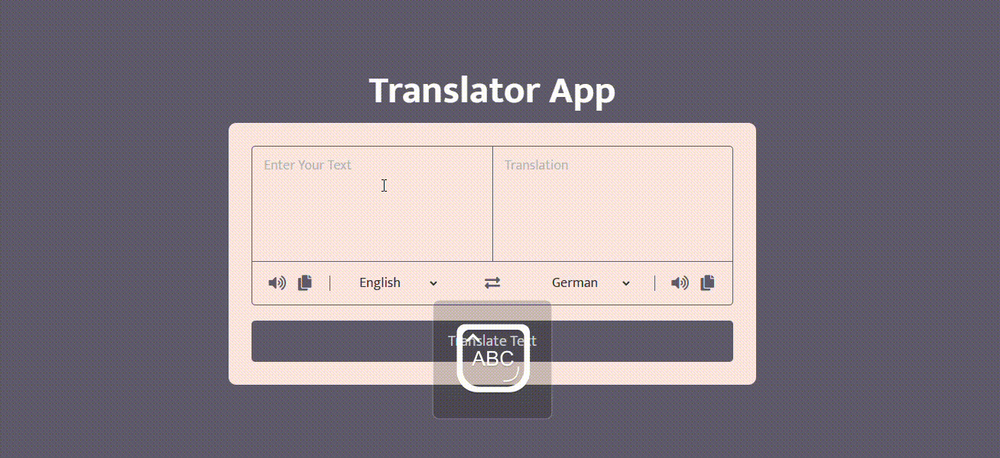

# Translator App

Translator App is a simple web application that allows users to translate text from one language to another. It supports multiple languages and provides a user-friendly interface for easy translation.

## Features

- Translate text from one language to another.
- Support for multiple languages.
- Exchange button to quickly swap input and output languages.
- Copy and speak functionality for both input and output texts.

## Technologies Used

- HTML5
- CSS3
- JavaScript
- MyMemory Translation API

## Demo

[View Demo](https://translatorjsapp.netlify.app)

## Getting Started

### Prerequisites

- Web browser with JavaScript enabled.

### Installation

1. Clone the repository:

   ```bash
   git clone https://github.com/Abou1205/translator-app.git
   ```

2. Open `index.html` in your web browser.

## Usage

1. Enter text in the "From" text area.
2. Select the source language from the dropdown menu.
3. Select the target language from the second dropdown menu.
4. Click the "Translate" button to translate the text.
5. The translated text will appear in the "To" text area.
6. Use the exchange button to swap input and output languages.
7. Use the copy and speak icons for convenient actions.

## API Usage

This app uses the MyMemory Translation API for language translation. You can obtain an API key by signing up at [MyMemory API](https://mymemory.translated.net/doc/spec.php).


## Acknowledgements

- [MyMemory Translation API](https://mymemory.translated.net/doc/spec.php) for language translation service.
- Icons used in the app are from [FontAwesome](https://fontawesome.com/).


## Gif

